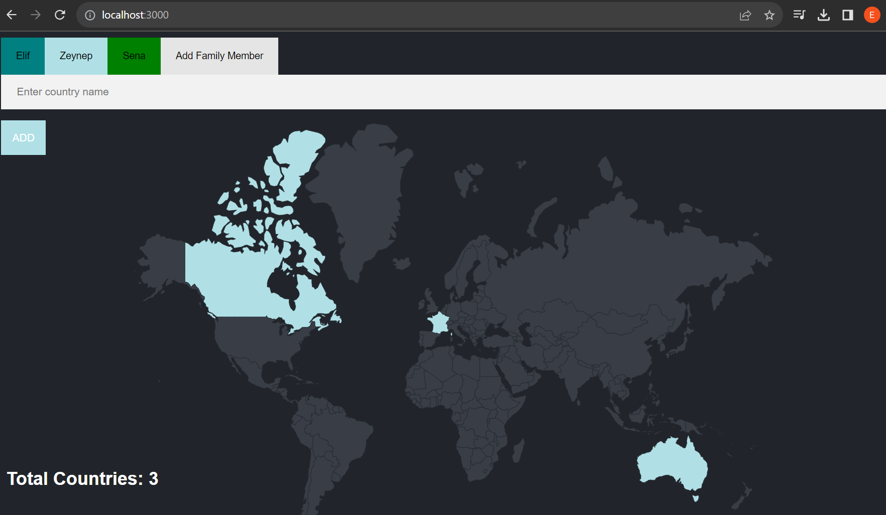
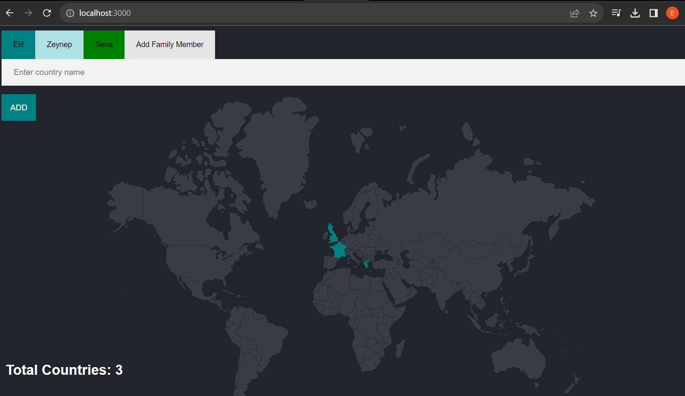

# family-travel-tracker

It is a web application that allows you to visually create all the countries visited by each family member on a world map.  
Developed using NodeJS and PostgreSQL.  
Each family member is represented by a different color and it is possible to add a new family member.  
  
  

